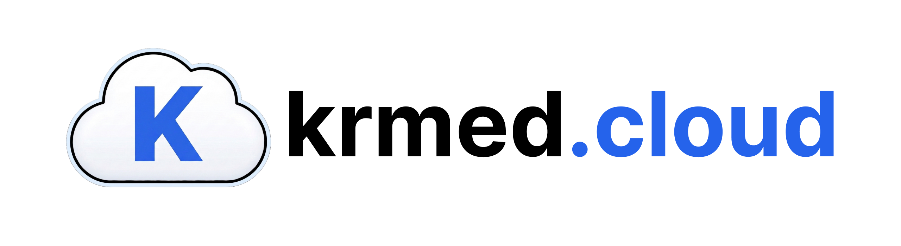
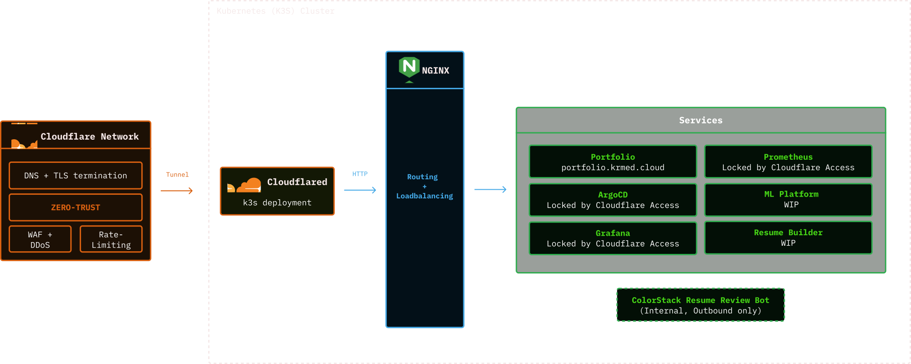

Real workloads, real users, zero cloud dependency. A self-hosted K3S cluster on Raspberry Pi hardware where every workload, config, and dashboard is managed as code and reconciled automatically. No manual applies, no drift, no exposed IP.

---

## What's Running

| App | Domain | Access | What it does |
|---|---|---|---|
| Portfolio | `portfolio.krmed.cloud` | Public | Personal site, 2-replica Nginx, always live |
| ArgoCD | `argocd.krmed.cloud` | Protected | GitOps control plane |
| Grafana | `grafana.krmed.cloud` | Protected | Live cluster, deployment, and traffic dashboards |
| Prometheus | `prometheus.krmed.cloud` | Protected | Metrics collection and storage |
| ColorStack AI Resume Bot | Discord | Outbound only | AI resume review bot serving the ColorStack community |

---

## Architecture

**Request flow**

`User` → `Cloudflare Edge` → `Cloudflared (tunnel)` → `NGINX Ingress` → `Service`

**Layer breakdown**

| Layer | Role |
|---|---|
| Cloudflare Network | DNS resolves to Cloudflare's edge, not the origin. TLS terminates here. WAF, DDoS mitigation, and rate limiting all fire before a byte hits the cluster |
| Cloudflared | A K3S deployment that holds an outbound-only encrypted tunnel to Cloudflare. No ports are open on the host. Traffic is forwarded in as plain HTTP to NGINX |
| NGINX Ingress | Routes requests by hostname to the correct ClusterIP service, with load balancing across replicas |
| Portfolio | Publicly routable, served by 2 Nginx replicas behind the ingress |
| ArgoCD / Grafana / Prometheus | Routed through NGINX but gated by Cloudflare Access. Authentication happens at the Cloudflare layer before the request reaches the cluster |
| ColorStack Resume Bot | No ingress at all. Opens an outbound WebSocket to the Discord API and lives entirely inside the cluster |
| ML Platform / Resume Builder | In progress, will follow the same ingress pattern |

---

## CI/CD

Every PR runs two parallel jobs before it can merge.

**Manifests gate** - builds the full production manifest with Kustomize, validates YAML syntax, renders both Helm charts inline (ingress-nginx and kube-prometheus-stack), then schema-validates everything against the Kubernetes 1.29 spec with `kubeconform`.

**Security gate** - gitleaks scans the diff for hardcoded secrets, Trivy scans manifests for HIGH/CRITICAL misconfigurations, and Trivy pulls and scans every container image on `linux/arm64` with registry auth.

Both must pass. No exceptions.

---

## Security

- No secrets in git. All credentials are pre-created cluster Secrets, referenced by name
- Every pod runs with `readOnlyRootFilesystem`, `runAsNonRoot`, and `seccompProfile: RuntimeDefault`
- Capabilities are dropped to the minimum each workload actually needs
- `.trivyignore` documents every suppressed CVE with justification, nothing is silently muted
- Cloudflare Tunnel means zero open ports on the host

---

## Stack

| | |
|---|---|
| Kubernetes | K3S on Raspberry Pi (arm64) |
| GitOps | ArgoCD with auto-sync, self-heal, and pruning |
| Config | Kustomize + Helm |
| Ingress | ingress-nginx |
| Monitoring | kube-prometheus-stack (Prometheus + Grafana + AlertManager) |
| Tunneling | Cloudflare Tunnel |
| Registry | GitHub Container Registry (ghcr.io) |
| Security scanning | Trivy + gitleaks |
| Dependency updates | Dependabot (weekly) |

---

## Related

- [krmed-portfolio](https://github.com/KRMed/krmed-portfolio) - the portfolio site deployed here
- [colorstack-ai-resume-review-discord-bot](https://github.com/KRMed/colorstack-ai-resume-review-discord-bot) - the AI resume bot running in the `bots` namespace
